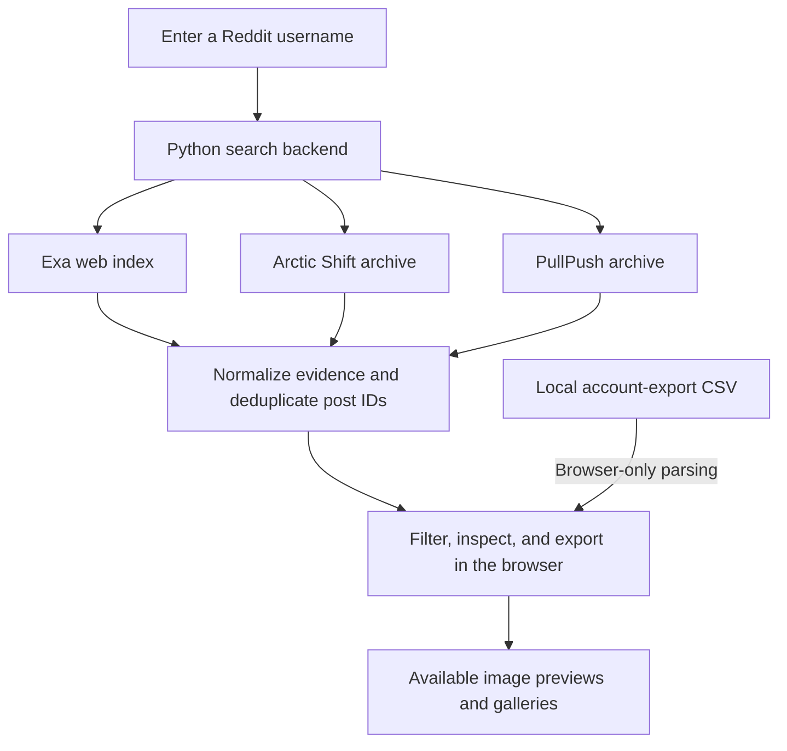

# Unhideme

**Find your public Reddit footprint across search indexes and archives.**

Unhideme brings username search, source evidence, archived post metadata, image galleries, and local account-export imports into one interface. It combines existing discovery techniques rather than inventing a new recovery method.

> Unhideme is not a complete Reddit archive or a privacy bypass. It cannot guarantee that every post will be found, restore unavailable media, or access private communities.

## Features

- **Multi-source search:** query Exa, Arctic Shift, and PullPush from a single username.
- **Evidence-aware results:** separate authored posts, mentions, and uncertain matches; inspect the evidence behind each result.
- **Deduplication:** merge matching Reddit post IDs while preserving contributing sources and stronger evidence.
- **Source coverage:** distinguish successful, partial, and failed queries instead of treating unavailable sources as zero results.
- **Filters and sorting:** filter by classification, subreddit, or text; sort by newest or oldest, with unknown dates last.
- **Images and galleries:** lazy-loaded previews, click-to-enlarge viewing, numbered selection, and keyboard navigation. NSFW and spoiler media stay hidden until revealed.
- **Local CSV import:** bring your own Reddit posts export without uploading the file to the server.
- **JSON export:** download the currently filtered results with their provenance.
- **Responsive interface:** paper-and-ink styling, restrained animations, and reduced-motion support.

## Quick start

### Requirements

- Python 3 with standard-library support for the backend's syntax.
- A modern browser.
- Internet access for search providers and remote images.
- Node.js with its built-in test runner, only if you want to run frontend tests.

The application backend uses the Python standard library. No Python package installation or frontend build step is required.

From the repository root, run:

```bash
python -m backend.app --port 8766
```

Open **http://127.0.0.1:8766/** in your browser. Stop the server with `Ctrl+C`.

The server binds to localhost by default. This command runs a foreground development/personal-use server; it does not install an always-on service.

## How it works



Archive results require an exact, case-insensitive match on the author field. Web-index matches are classified using the evidence available in indexed results. Matching records are merged by post ID, retaining source attribution and available dates and image metadata.

Sources fail independently: useful results can still be returned when another provider is unavailable. If every source fails, the API returns an error rather than fabricated results.

### Search bounds

| Source | Current query scope |
| --- | --- |
| Exa | Two web searches, up to ten hits per query |
| Arctic Shift | One page of up to 100 posts |
| PullPush | One page of up to 100 posts |

Archive pagination is not implemented. Counts from different providers may overlap and should not be added together as unique posts. A successful source status means the bounded query completed—not that its coverage is exhaustive.

## Import your account export

1. Obtain your Reddit account data export.
2. Extract it locally and locate the posts CSV.
3. Search for your username in Unhideme.
4. Use **Bring your own account export** and confirm that the file belongs to the entered username.
5. Select the CSV to merge valid records into the current results.

**Import limits:** 5 MB per file and 20,000 rows. ZIP files are not accepted.

Supported headers include `id`, `post_id`, `name`, `permalink`, `link`, `subreddit`, `title`, `date`, `created_utc`, `timestamp`, `body`, `selftext`, `author`, and `username`.

A record needs a safe Reddit post permalink or a `t3_` post ID plus subreddit. Outbound article links do not establish post identity. An explicit author column must match the entered username. Invalid or ambiguous records are reported as skipped.

Quoted commas, multiline fields, escaped quotes, BOM, and CRLF are supported. Imported records are **self-supplied evidence**, not independently verified archive findings. Duplicate records preserve stronger existing evidence and attach import provenance.

Files are processed entirely in the browser. Imported data stays in page memory; starting a new search clears it.

## Images

Image previews use available archive metadata and allowlisted Reddit image hosts. Galleries support up to 20 images, with previous/next controls and arrow-key navigation.

- NSFW and spoiler images require explicit reveal.
- Missing or blocked images show an unavailable-image message.
- Video playback is not supported.
- Images are fetched directly by the browser, not proxied or recovered by the backend.

An archived image URL does not guarantee that the image still exists.

## Configuration

Exa uses its public keyless MCP endpoint by default. You can optionally set `EXA_API_KEY` in the server process environment to use the Exa API adapter.

Never place API keys in frontend files or commit them to source control. Provider endpoints can change, become unavailable, or apply rate limits.

## Privacy and limitations

- Search usernames are sent to external search/archive providers.
- The application suppresses HTTP request logging and caches search results in process memory for up to ten minutes.
- Local CSV files are not uploaded for processing.
- Image requests omit the referrer, but image hosts still receive the viewer's IP address.
- The interface requests fonts from Google Fonts, with local fallbacks.
- Cancelling a browser request stops waiting for results; it does not necessarily stop upstream work already running.
- Authored classification reflects indexed attribution, an exact archive author field, or confirmed local export data—not direct verification by live Reddit.
- Mentions may be comments by the username or references made by other people.
- Results can be incomplete, stale, deleted, or removed from Reddit. No results does not prove that an account had no activity.

Use the tool responsibly for your own history or other legitimate public-content research. Do not treat it as a way to bypass access controls or establish someone's identity.

## Project structure

```text
backend/
  app.py             HTTP server, search providers, evidence, and deduplication
  media.py           Image metadata extraction and URL validation
static/
  index.html         Page layout
  style.css          Styling, responsive layout, and animations
  app.js             Search UI, filters, sorting, and export
  import.js          Browser-only CSV parsing and merging
  media.js           Image previews and gallery viewer
  *.test.cjs         Frontend tests
tests/               Backend tests
README.md
```

## API

| Endpoint | Purpose |
| --- | --- |
| `GET /api/health` | Server health and provider identity; not an upstream connectivity check |
| `GET /api/search?username=example_user` | Search and return deduplicated evidence-aware results |

Search responses include results, classifications, evidence strength, source lists, optional archive timestamps, image metadata, warnings, cache status, and source-level statuses and counts.

## Tests

Run from the repository root:

```bash
python -m unittest discover -s tests -v
node --test static/*.test.cjs
```

Automated tests use test-only fixtures and local HTTP transport fixtures. They cover validation, provider failure handling, evidence merging, static serving, CSV import, filtering, branding, and media behavior. They do not guarantee that third-party services are currently available.

## Contributing

Keep changes small and include regression tests for behavior changes. Preserve source provenance, browser-only import processing, safe URL handling, and honest coverage limitations. Do not substitute sample data when a production source fails.
